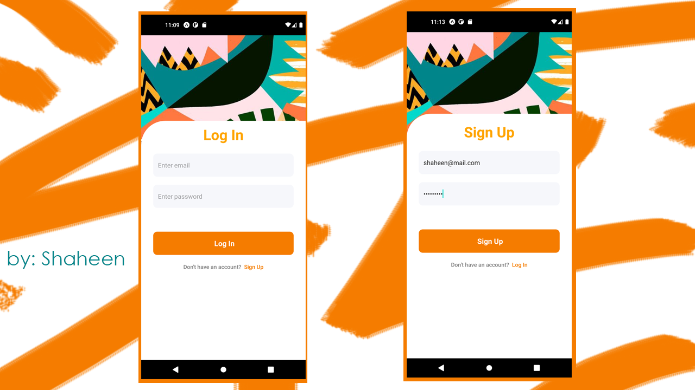
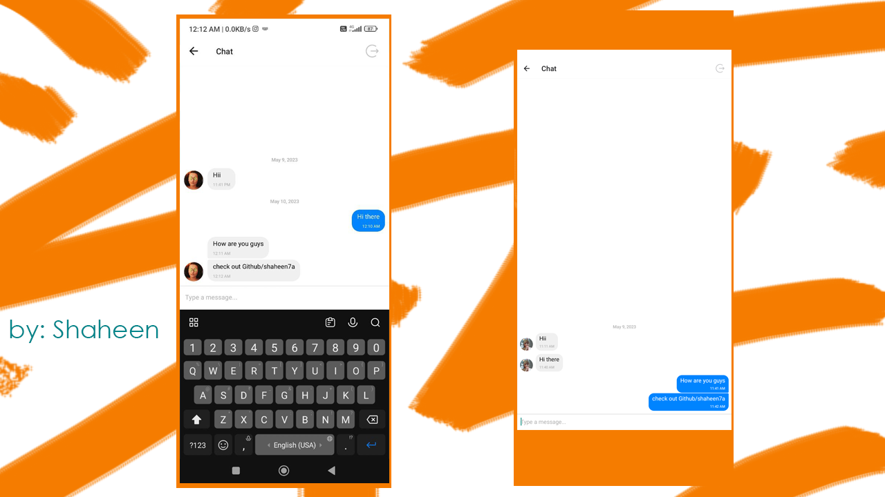

# Android--Fire-Chat

## Welcome! 👋

Thanks for checking out this Application.
A simple Android chat app is an application that allows users to exchange text messages with each other in real-time. The app typically consists of a simple interface with a chat window where users can type and send messages to each other, and a list of active conversations.

### Links

- App URL: [Github](https://github.com/shaheen7a/Android--Fire-Chat)
- APK Link: [Dropbox](https://www.dropbox.com/s/4zz4hbzvo02aosh/FireChat.apk?dl=0)

## My process

### Built with

- React Native
- React Native Navigation
- Expo
- CSS
- JavaScript
- JSX

## Author

- Linkedin - [@aous-shaheen-381636221](https://www.linkedin.com/in/shaheen2001/)
- Facebook - [@aoushaheen7](https://www.facebook.com/shaheen72001/)
